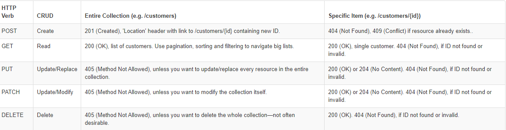

##  APIs

## What does REST stand for?
. REST is an architectural style for building distributed systems based on hypermedia. REST is independent of any underlying protocol and is not necessarily tied to HTTP. However, most common REST API implementations use HTTP as the application protocol, and this guide focuses on designing REST APIs for HTTP.

A primary advantage of REST over HTTP is that it uses open standards, and does not bind the implementation of the API or the client applications to any specific implementation. For example, a REST web service could be written in ASP.NET, and client applications can use any language or toolset that can generate HTTP requests and parse HTTP responses.

## REST APIs are designed around a ____.
resources

## What is an identifer of a resource? Give an example.
A resource has an identifier, which is a URI that uniquely identifies that resource. For example, the URI for a particular customer order might be:

HTTP
https://adventure-works.com/orders/1

## What are the most common HTTP verbs?
 The most common operations are GET, POST, PUT, PATCH, and DELETE.

## What should the URIs be based on?

## Give an example of a good URI.
## What does it mean to have a ‘chatty’ web API? Is this a good or a bad thing?
## What status code does a successful GET request return?
GET retrieves a representation of the resource at the specified URI. The body of the response message contains the details of the requested resource.A successful GET method typically returns HTTP status code 200 (OK). If the resource cannot be found, the method should return 404 (Not Found).
## What status code does an unsuccessful GET request return?
 If the resource cannot be found, the method should return 404 (Not Found).
## What status code does a successful POST request return?
POST creates a new resource at the specified URI. The body of the request message provides the details of the new resource. Note that POST can also be used to trigger operations that don't actually create resources.
If a POST method creates a new resource, it returns HTTP status code 201 (Created). The URI of the new resource is included in the Location header of the response. The response body contains a representation of the resource.
## What status code does a successful DELETE request return?
if the delete operation is successful, the web server should respond with HTTP status code 204, indicating that the process has been successfully handled, but that the response body contains no further information. If the resource doesn't exist, the web server can return HTTP 404 (Not Found).

--------------

## RegEx

* How would you match your name using RegEx?

RegExr was created by gskinner.com, and is proudly hosted by Media Temple.

Regular expressions (regex or regexp) are extremely useful in extracting information from any text by searching for one or more matches of a specific search pattern (i.e. a specific sequence of ASCII or unicode characters).
Fields of application range from validation to parsing/replacing strings, passing through translating data to other formats and web scraping.
One of the most interesting features is that once you’ve learned the syntax, you can actually use this tool in (almost) all programming languages ​​(JavaScript, Java, VB, C #, C / C++, Python, Perl, Ruby, Delphi, R, Tcl, and many others) with the slightest distinctions about the support of the most advanced features and syntax versions supported by the engines).

* data validation (for example check if a time string i well-formed)
* data scraping (especially web scraping, find all pages that contain a certain set of words eventually in a specific    order)
* data wrangling (transform data from “raw” to another format)
* string parsing (for example catch all URL GET parameters, capture text inside a set of parenthesis)
* string replacement (for example, even during a code session using a common IDE to translate a Java or C# class in the respective JSON object — replace “;” with “,” make it lowercase, avoid type declaration, etc.)
* syntax highlightning, file renaming, packet sniffing and many other applications involving strings (where data need not be textual)
