# Chart.js, Canvas

Charts are far better for displaying data visually than tables and have the added benefit that no one is ever going to press-gang them into use as a layout tool.

 They’re easier to look at and convey data quickly, but they’re not always easy to create.

A great way to get started with charts is with Chart.

js, a JavaScript plugin that uses HTML5’s canvas element to draw the graph onto the page. It’s a well documented plugin that makes using all kinds of bar charts, line charts, pie charts and more, incredibly easy.

To see how to use chart.js we’re going to create a set of 3 graphs; one will show the number of buyers a fictional product has over the course of 6 months, this will be a line chart; the second will show which countries the customers come from, this will be the pie chart; finally we’ll use a bar chart to show profit over the period.

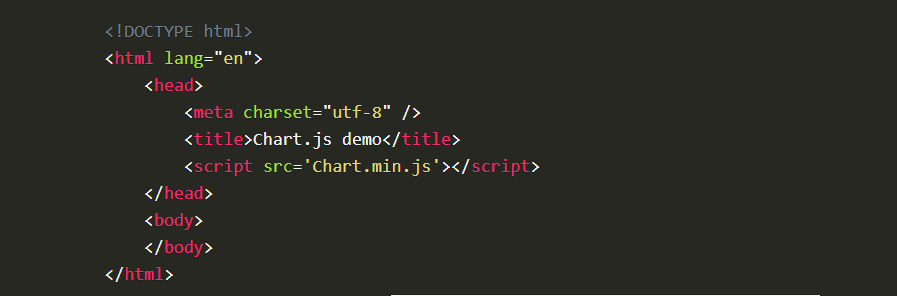

-----------

## Setting up

The first thing we need to do is download Chart.js. Copy the Chart.min.js out of the unzipped folder and into the directory you’ll be working in. Then create a new html page and import the script

---------

## Drawing a line chart

To draw a line chart, the first thing we need to do is create a canvas element in our HTML in which Chart.
js can draw our chart.
we need to write a script that will retrieve the context of the canvas

(We can actually pass some options to the chart via the Line method, but we’re going to stick to the data for now to keep it simple.)

Inside the same script tags we need to create our data, in this instance it’s an object that contains labels for the base of our chart and datasets to describe the values on the chart.

-------

## Drawing a pie chart

Our line chart is complete, so let’s move on to our pie chart. First, we need the canvas element:

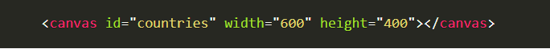

---------

## Chart.js

## Installation

You can get the latest version of Chart.js from npm , the GitHub releases , or use a Chart.js CDN . Detailed installation instructions can be found on the installation page.

## Creating a Chart

It's easy to get started with Chart.js. All that's required is the script included in your page along with a single `<canvas>` node to render the chart.

In this example, we create a bar chart for a single dataset and render that in our page. You can see all the ways to use Chart.js in the usage documentation.

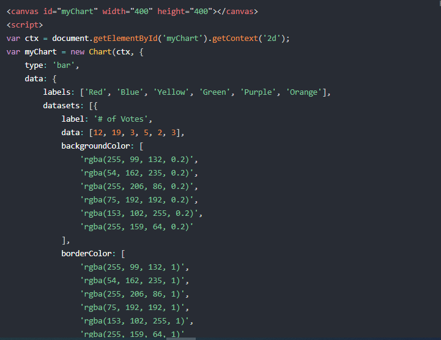

## Contributing

Before submitting an issue or a pull request to the project, please take a moment to look over the contributing guidelines first.

--------

## Basic usage of canvas

Let's start this tutorial by looking at the `<canvas>` HTML element itself. At the end of this page, you will know how to set up a canvas 2D context and have drawn a first example in your browser.

At first sight a `<canvas>` looks like the ` `element, with the only clear difference being that it doesn't have the src and alt attributes. Indeed, the `<canvas> `element has only two attributes, width and height.

 These are both optional and can also be set using DOM properties. When no width and height attributes are specified, the canvas will initially be 300 pixels wide and 150 pixels high. The element can be sized arbitrarily by CSS, but during rendering the image is scaled to fit its layout size: if the CSS sizing doesn't respect the ratio of the initial canvas, it will appear distorted.

The id attribute isn't specific to the `<canvas>` element but is one of the global HTML attributes which can be applied to any HTML element (like class for instance). It is always a good idea to supply an id because this makes it much easier to identify it in a script.

The `<canvas>` element can be styled just like any normal image (margin, border, background…).

These rules, however, don't affect the actual drawing on the canvas. We'll see how this is done in a dedicated chapter of this tutorial. When no styling rules are applied to the canvas it will initially be fully transparent.

------

The `<canvas>` element differs from an `` tag in that, like for `<video>`, `<audio>`, or `<picture>` elements, it is easy to define some fallback content, to be displayed in older browsers not supporting it, like versions of Internet Explorer earlier than version 9 or textual browsers. You should always provide fallback content to be displayed by those browsers.

Providing fallback content is very straightforward: just insert the alternate content inside the `<canvas>` element. Browsers that don't support `<canvas>` will ignore the container and render the fallback content inside it. Browsers that do support `<canvas>` will ignore the content inside the container, and just render the canvas normally.

------

Required `</canvas>` tag
As a consequence of the way fallback is provided, unlike the `` element, the `<canvas>` element requires the closing tag (`</canvas>`). If this tag is not present, the rest of the document would be considered the fallback content and wouldn't be displayed.

If fallback content is not needed, a simple `<canvas id="foo" ...></canvas>` is fully compatible with all browsers that support canvas at all.

----------

The first line in the script retrieves the node in the DOM representing the `<canvas>` element by calling the document.getElementById() method. Once you have the element node, you can access the drawing context using its getContext() method.

--------

## Checking for support

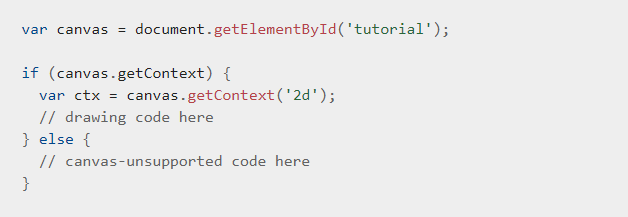

---------

## Drawing shapes with canvas

Now that we have set up our canvas environment, we can get into the details of how to draw on the canvas. By the end of this article, you will have learned how to draw rectangles, triangles, lines, arcs and curves, providing familiarity with some of the basic shapes. Working with paths is essential when drawing objects onto the canvas and we will see how that can be done.

## The grid

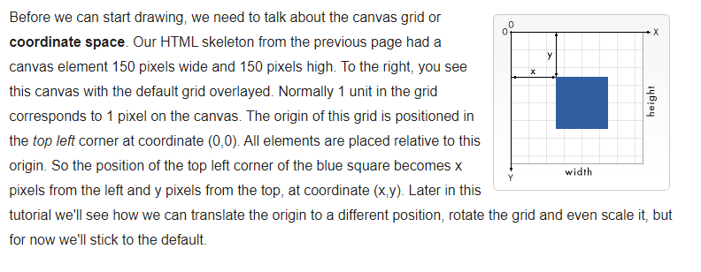

-----

## Drawing rectangles

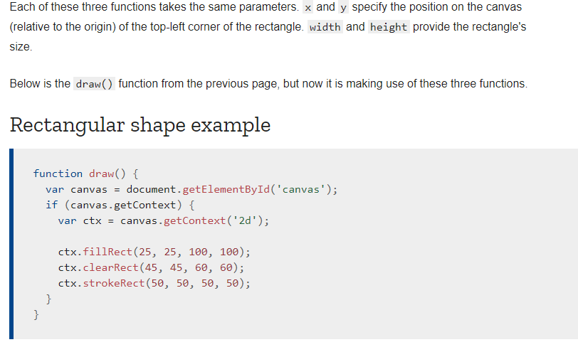

---------

## Drawing paths

Now let's look at paths. A path is a list of points, connected by segments of lines that can be of different shapes, curved or not, of different width and of different color. A path, or even a subpath, can be closed. To make shapes using paths, we take some extra steps:

* First, you create the path.
* Then you use drawing commands to draw into the path.
* Once the path has been created, you can stroke or fill the path to render it.
  Here are the functions used to perform these steps:

-------

## Drawing a triangle

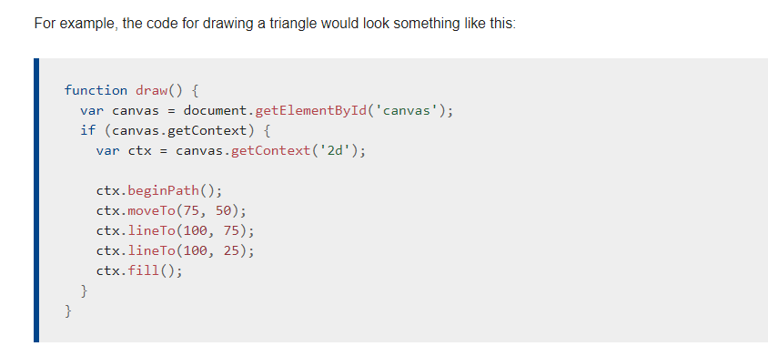

-------

## Moving the pen

One very useful function, which doesn't actually draw anything but becomes part of the path list described above, is the moveTo() function. You can probably best think of this as lifting a pen or pencil from one spot on a piece of paper and placing it on the next.

**moveTo(x, y)**
Moves the pen to the coordinates specified by x and y.
When the canvas is initialized or beginPath() is called, you typically will want to use the moveTo() function to place the starting point somewhere else. We could also use moveTo() to draw unconnected paths. Take a look at the smiley face below.

----------

## Arcs

To draw arcs or circles, we use the arc() or arcTo() methods.

**arc(x, y, radius, startAngle, endAngle, counterclockwise)**

Draws an arc which is centered at **(x, y)** position with radius r starting at startAngle and ending at endAngle going in the given direction indicated by counterclockwise (defaulting to clockwise).

**arcTo(x1, y1, x2, y2, radius)**

Draws an arc with the given control points and radius, connected to the previous point by a straight line.
Let's have a more detailed look at the arc method
, which takes six parameters:

 x and y are the coordinates of the center of the circle on which the arc should be drawn. radius is self-explanatory. The startAngle and endAngle parameters define the start and end points of the arc in radians, along the curve of the circle. These are measured from the x axis.

  The counterclockwise parameter is a Boolean value which, when true, draws the arc counterclockwise; otherwise, the arc is drawn clockwise.

---------

The following example is a little more complex than the ones we've seen above. It draws 12 different arcs all with different angles and fills.

The two for loops are for looping through the rows and columns of arcs. For each arc, we start a new path by calling *beginPath()*. In the code, each of the parameters for the arc is in a variable for clarity, but you wouldn't necessarily do that in real life.

The x and y coordinates should be clear enough. radius and startAngle are fixed. The endAngle starts at 180 degrees (half a circle) in the first column and is increased by steps of 90 degrees, culminating in a complete circle in the last column.

The statement for the clockwise parameter results in the first and third row being drawn as clockwise arcs and the second and fourth row as counterclockwise arcs. Finally, the if statement makes the top half stroked arcs and the bottom half filled arcs.

-------

## Bezier and quadratic curves

The next type of paths available are Bézier curves, available in both cubic and quadratic varieties. These are generally used to draw complex organic shapes.

**quadraticCurveTo(cp1x, cp1y, x, y)**

Draws a quadratic Bézier curve from the current pen position to the end point specified by x and y, using the control point specified by cp1x and cp1y.

**bezierCurveTo(cp1x, cp1y, cp2x, cp2y, x, y)**
Draws a cubic Bézier curve from the current pen position to the end point specified by x and y, using the control points specified by **(cp1x, cp1y) and (cp2x, cp2y)**.

The difference between these can best be described using the image on the right. A quadratic Bézier curve has a start and an end point (blue dots) and just one control point (indicated by the red dot) while a cubic Bézier curve uses two control points.

The x and y parameters in both of these methods are the coordinates of the end point. cp1x and cp1y are the coordinates of the first control point, and cp2x and cp2y are the coordinates of the second control point.

Using quadratic and cubic Bézier curves can be quite challenging, because unlike vector drawing software like Adobe Illustrator, we don't have direct visual feedback as to what we're doing. This makes it pretty hard to draw complex shapes. In the following example, we'll be drawing some simple organic shapes, but if you have the time and, most of all, the patience, much more complex shapes can be created.

There's nothing very difficult in these examples. In both cases we see a succession of curves being drawn which finally result in a complete shape.

-------

## Rectangles
In addition to the three methods we saw in Drawing rectangles, which draw rectangular shapes directly to the canvas, there's also the rect() method, which adds a rectangular path to a currently open path.

**rect(x, y, width, height**)

Draws a rectangle whose top-left corner is specified by **(x, y)** with the specified width and height.
Before this method is executed, the moveTo() method is automatically called with the parameters (x,y). In other words, the current pen position is automatically reset to the default coordinates.

## Making combinations

So far, each example on this page has used only one type of path function per shape. However, there's no limitation to the number or types of paths you can use to create a shape.
 So in this final example, let's combine all of the path functions to make a set of very famous game characters.

## Path2D objects

As we have seen in the last example, there can be a series of paths and drawing commands to draw objects onto your canvas. To simplify the code and to improve performance, the Path2D object, available in recent versions of browsers, lets you cache or record these drawing commands.
 You are able to play back your paths quickly.
Let's see how we can construct a Path2D object:

## Path2D()

The Path2D() constructor returns a newly instantiated Path2D object, optionally with another path as an argument (creates a copy), or optionally with a string consisting of SVG path data.

All path methods like moveTo, rect, arc or quadraticCurveTo, etc., which we got to know above, are available on Path2D objects.

The Path2D API also adds a way to combine paths using the addPath method. This can be useful when you want to build objects from several components .

* Path2D.addPath(path [, transform])
Adds a path to the current path with an optional transformation matrix.

--------

## Applying styles and colors

In the chapter about drawing shapes, we used only the default line and fill styles. Here we will explore the canvas options we have at our disposal to make our drawings a little more attractive. You will learn how to add different colors, line styles, gradients, patterns and shadows to your drawings.

-----

## Colors

Up until now we have only seen methods of the drawing context. If we want to apply colors to a shape, there are two important properties we can use: fillStyle and strokeStyle.

**fillStyle = color**
Sets the style used when filling shapes.

**strokeStyle = color**
Sets the style for shapes' outlines.
color is a string representing a CSS `<color>`, a gradient object, or a pattern object. We'll look at gradient and pattern objects later. By default, the stroke and fill color are set to black (CSS color value #000000).

----

## A fillStyle example

In this example, we once again use two for loops to draw a grid of rectangles, each in a different color. The resulting image should look something like the screenshot. 

There is nothing too spectacular happening here.

 We use the two variables i and j to generate a unique RGB color for each square, and only modify the red and green values. The blue channel has a fixed value. 
 
 By modifying the channels, you can generate all kinds of palettes. By increasing the steps, you can achieve something that looks like the color palettes Photoshop uses.

--------

## A strokeStyle example

This example is similar to the one above, but uses the strokeStyle property to change the colors of the shapes' outlines. We use the arc() method to draw circles instead of squares.

----

## Transparency

In addition to drawing opaque shapes to the canvas, we can also draw semi-transparent (or translucent) shapes. This is done by either setting the globalAlpha property or by assigning a semi-transparent color to the stroke and/or fill style.

**globalAlpha = transparencyValue**

Applies the specified transparency value to all future shapes drawn on the canvas. The value must be between 0.0 (fully transparent) to 1.0 (fully opaque). This value is 1.0 (fully opaque) by default.

The globalAlpha property can be useful if you want to draw a lot of shapes on the canvas with similar transparency, but otherwise it's generally more useful to set the transparency on individual shapes when setting their colors.

Because the strokeStyle and fillStyle properties accept CSS rgba color values, we can use the following notation to assign a transparent color to them.

------

## Line styles
There are several properties which allow us to style lines.

**lineWidth = value**
Sets the width of lines drawn in the future.

**lineCap = type**
Sets the appearance of the ends of lines.

**lineJoin = type**
Sets the appearance of the "corners" where lines meet.

**miterLimit = value**
Establishes a limit on the miter when two lines join at a sharp angle, to let you control how thick the junction becomes.

**getLineDash()**
Returns the current line dash pattern array containing an even number of non-negative numbers.

**setLineDash(segments)**
Sets the current line dash pattern.

**lineDashOffset = value**
Specifies where to start a dash array on a line.

-------

## A demo of the miterLimit property

As you've seen in the previous example, when joining two lines with the miter option, the outside edges of the two joining lines are extended up to the point where they meet.

 For lines which are at large angles with each other, this point is not far from the inside connection point. However, as the angles between each line decreases, the distance (miter length) between these points increases exponentially.

The miterLimit property determines how far the outside connection point can be placed from the inside connection point. If two lines exceed this value, a bevel join gets drawn instead.

 Note that the maximum miter length is the product of the line width measured in the current coordinate system, by the value of this miterLimit property (whose default value is 10.0 in the HTML `<canvas>`), so the miterLimit can be set independently from the current display scale or any affine transforms of paths: it only influences the effectively rendered shape of line edges.

More exactly, the miter limit is the maximum allowed ratio of the extension length (in the HTML canvas, it is measured between the outside corner of the joined edges of the line and the common endpoint of connecting segments specified in the path) to half the line width.

 It can equivalently be defined as the maximum allowed ratio of the distance between the inside and outside points of jonction of edges, to the total line width. It is then equal to the cosecant of half the minimum inner angle of connecting segments below which no miter join will be rendered, but only a bevel join:

* miterLimit = max miterLength / lineWidth = 1 / sin ( min θ / 2 )
The default miter limit of 10.0 will strip all miters for sharp angles below about 11 degrees.

* A miter limit equal to √2 ≈ 1.4142136 (rounded up) will strip miters for all acute angles, keeping miter joins only for  obtuse or right angles.

* A miter limit equal to 1.0 is valid but will disable all miters.

* Values below 1.0 are invalid for the miter limit.

Here's a little demo in which you can set miterLimit dynamically and see how this effects the shapes on the canvas. The blue lines show where the start and endpoints for each of the lines in the zig-zag pattern are.

If you specify a miterLimit value below 4.2 in this demo, none of the visible corners will join with a miter extension, but only with a small bevel near the blue lines; with a miterLimit above 10, most corners in this demo should join with a miter far away from the blue lines, and whose height is decreasing between corners from left to right because they connect with growing angles; with intermediate values, the corners on the left side will only join with a bevel near the blue lines, and the corners on the right side with a miter extension (also with a decreasing height).

-----

## Using line dashes

The setLineDash method and the lineDashOffset property specify the dash pattern for lines. The setLineDash method accepts a list of numbers that specifies distances to alternately draw a line and a gap and the lineDashOffset property sets an offset where to start the pattern.

In this example we are creating a marching ants effect. It is an animation technique often found in selection tools of computer graphics programs. It helps the user to distinguish the selection border from the image background by animating the border. In a later part of this tutorial, you can learn how to do this and other

-----

## Gradients

Just like any normal drawing program, we can fill and stroke shapes using linear, radial and conic gradients. We create a CanvasGradient object by using one of the following methods. We can then assign this object to the fillStyle or strokeStyle properties.

createLinearGradient(x1, y1, x2, y2)
Creates a linear gradient object with a starting point of (x1, y1) and an end point of (x2, y2).
createRadialGradient(x1, y1, r1, x2, y2, r2)
Creates a radial gradient. The parameters represent two circles, one with its center at (x1, y1) and a radius of r1, and the other with its center at (x2, y2) with a radius of r2.
createConicGradient(angle, x, y)
Creates a conic gradient object with a starting angle of angle in radians, at the position (x, y).

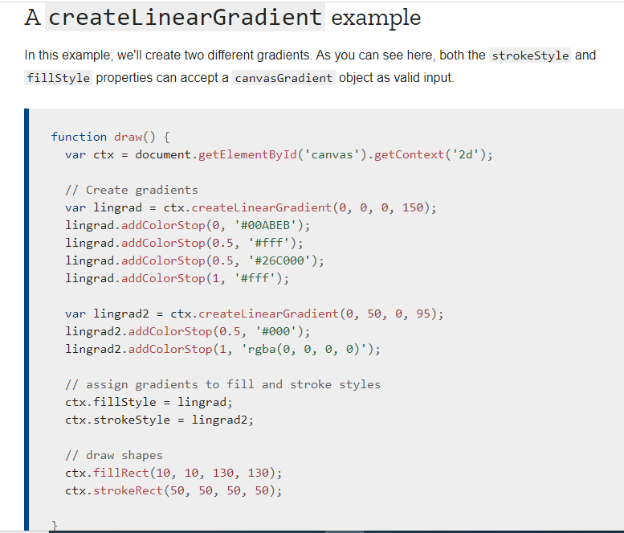

-------

## Patterns
In one of the examples on the previous page, we used a series of loops to create a pattern of images. There is, however, a much simpler method: the createPattern() method.

createPattern(image, type)
Creates and returns a new canvas pattern object. image is a CanvasImageSource (that is, an HTMLImageElement, another canvas, a `<video>` element, or the like. type is a string indicating how to use the image.
The type specifies how to use the image in order to create the pattern, and must be one of the following string values:

* repeat
Tiles the image in both vertical and horizontal directions.

* repeat-x
Tiles the image horizontally but not vertically.

* repeat-y
Tiles the image vertically but not horizontally.

* no-repeat
Doesn't tile the image. It's used only once.

We use this method to create a CanvasPattern object which is very similar to the gradient methods we've seen above. Once we've created a pattern, we can assign it to the fillStyle or strokeStyle properties

--------

## Shadows
Using shadows involves just four properties:

**shadowOffsetX = float**
Indicates the horizontal distance the shadow should extend from the object. This value isn't affected by the transformation matrix. The default is 0.

**shadowOffsetY = float**
Indicates the vertical distance the shadow should extend from the object. This value isn't affected by the transformation matrix. The default is 0.

**shadowBlur = float**
Indicates the size of the blurring effect; this value doesn't correspond to a number of pixels and is not affected by the current transformation matrix. The default value is 0.

**shadowColor = color**
A standard CSS color value indicating the color of the shadow effect; by default, it is fully-transparent black.
The properties shadowOffsetX and shadowOffsetY indicate how far the shadow should extend from the object in the X and Y directions; these values aren't affected by the current transformation matrix. Use negative values to cause the shadow to extend up or to the left, and positive values to cause the shadow to extend down or to the right. These are both 0 by default.

The shadowBlur property indicates the size of the blurring effect; this value doesn't correspond to a number of pixels and is not affected by the current transformation matrix. The default value is 0.

The shadowColor property is a standard CSS color value indicating the color of the shadow effect; by default, it is fully-transparent black.

--------

## Canvas fill rules

When using fill (or clip and isPointInPath) you can optionally provide a fill rule algorithm by which to determine if a point is inside or outside a path and thus if it gets filled or not. This is useful when a path intersects itself or is nested.

Two values are possible:

"nonzero": The non-zero winding rule, which is the default rule.
"evenodd": The even-odd winding rule.

-------

## Drawing text

The canvas rendering context provides two methods to render text:

fillText(text, x, y [, maxWidth])
Fills a given text at the given (x,y) position. Optionally with a maximum width to draw.
strokeText(text, x, y [, maxWidth])
Strokes a given text at the given (x,y) position. Optionally with a maximum width to draw.

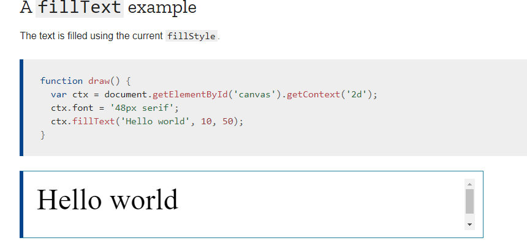

--------

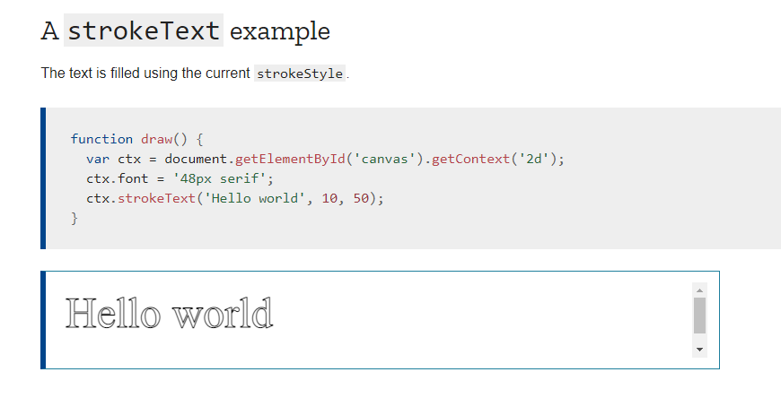

------

## Styling text

In the examples above we are already making use of the font property to make the text a bit larger than the default size. There are some more properties which let you adjust the way the text gets displayed on the canvas:

font = value
The current text style being used when drawing text. This string uses the same syntax as the CSS font property. The default font is 10px sans-serif.

textAlign = value
Text alignment setting. Possible values: start, end, left, right or center. The default value is start.

textBaseline = value
Baseline alignment setting. Possible values: top, hanging, middle, alphabetic, ideographic, bottom. The default value is alphabetic.

direction = value
Directionality. Possible values: ltr, rtl, inherit. The default value is inherit.
These properties might be familiar to you, if you have worked with CSS before.

The following diagram from the WHATWG demonstrates the various baselines supported by the textBaseline property.

----

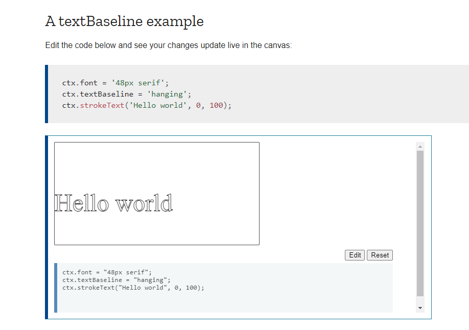

-----

## Advanced text measurements
In the case you need to obtain more details about the text, the following method allows you to measure it.

measureText()
Returns a TextMetrics object containing the width, in pixels, that the specified text will be when drawn in the current text style.
The following code snippet shows how you can measure a text and get its width.

-------

## Gecko-specific notes

In Gecko (the rendering engine of Firefox, Firefox OS and other Mozilla based applications), some prefixed APIs were implemented in earlier versions to draw text on a canvas. These are now deprecated and removed, and are no longer guaranteed to work.

---------

