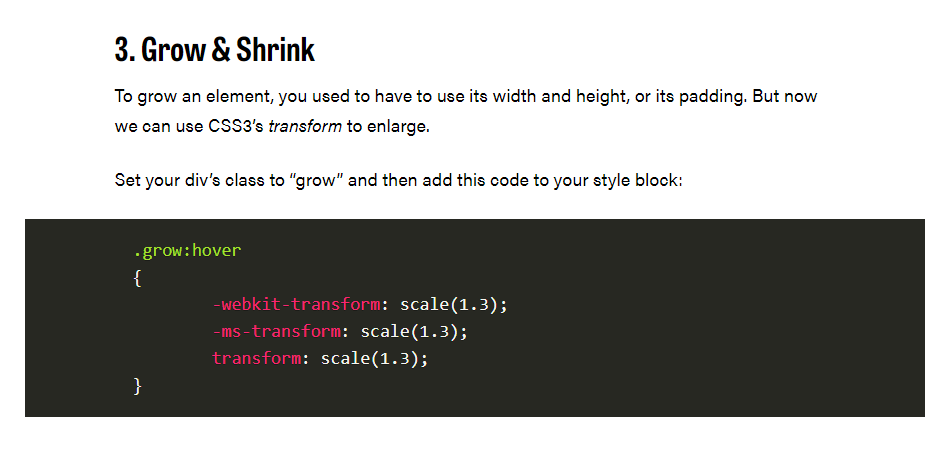

## Transforms
With CSS3 came new ways to position and alter elements. Now general layout techniques can be revisited with alternative ways to size, position, and change elements. All of these new techniques are made possible by the transform property.

The transform property comes in two different settings, two-dimensional and three-dimensional. Each of these come with their own individual properties and values.

Within this lesson we’ll take a look at both two-dimensional and three-dimensional transforms. Generally speaking, browser support for the transform property isn’t great, but it is getting better every day. For the best support vendor prefixes are encouraged, however you may need to download the nightly version of Chrome to see all of these transforms in action.

## Transform Syntax

The actual syntax for the transform property is quite simple, including the transform property followed by the value. The value specifies the transform type followed by a specific amount inside parentheses.

-------

**2D Transforms**

Elements may be distorted, or transformed, on both a two-dimensional plane or a three-dimensional plane. Two-dimensional transforms work on the x and y axes, known as horizontal and vertical axes. Three-dimensional transforms work on both the x and y axes, as well as the z axis. These three-dimensional transforms help define not only the length and width of an element, but also the depth. We’ll start by discussing how to transform elements on a two-dimensional plane, and then work our way into three-dimensional transforms.

----------

**2D Rotate**

The transform property accepts a handful of different values. The rotate value provides the ability to rotate an element from 0 to 360 degrees. Using a positive value will rotate an element clockwise, and using a negative value will rotate the element counterclockwise. The default point of rotation is the center of the element, 50% 50%, both horizontally and vertically. Later we will discuss how you can change this default point of rotation.

-----------

**2D Scale**

Using the scale value within the transform property allows you to change the appeared size of an element. The default scale value is 1, therefore any value between .99 and .01 makes an element appear smaller while any value greater than or equal to 1.01 makes an element appear larger.

---------

**2D Translate**

The translate value works a bit like that of relative positioning, pushing and pulling an element in different directions without interrupting the normal flow of the document. Using the translateX value will change the position of an element on the horizontal axis while using the translateY value will change the position of an element on the vertical axis.

As with the scale value, to set both the x and y axis values at once, use the translate value and declare the x axis value first, followed by a comma, and then the y axis value.

The distance values used within the translate value may be any general length measurement, most commonly pixels or percentages. Positive values will push an element down and to the right of its default position while negative values will pull an element up and to the left of its default position.

---------

**2D Skew**

The last transform value in the group, skew, is used to distort elements on the horizontal axis, vertical axis, or both. The syntax is very similar to that of the scale and translate values. Using the skewX value distorts an element on the horizontal axis while the skewY value distorts an element on the vertical axis. To distort an element on both axes the skew value is used, declaring the x axis value first, followed by a comma, and then the y axis value.%p

The distance calculation of the skew value is measured in units of degrees. Length measurements, such as pixels or percentages, do not apply here.

------------

**Combining Transforms**

It is common for multiple transforms to be used at once, rotating and scaling the size of an element at the same time for example. In this event multiple transforms can be combined together. To combine transforms, list the transform values within the transform property one after the other without the use of commas.

Using multiple transform declarations will not work, as each declaration will overwrite the one above it. The behavior in that case would be the same as if you were to set the height of an element numerous times

--------------

## Transitions & Animations

One evolution with CSS3 was the ability to write behaviors for transitions and animations. Front end developers have been asking for the ability to design these interactions within HTML and CSS, without the use of JavaScript or Flash, for years. Now their wish has come true.

With CSS3 transitions you have the potential to alter the appearance and behavior of an element whenever a state change occurs, such as when it is hovered over, focused on, active, or targeted.

Animations within CSS3 allow the appearance and behavior of an element to be altered in multiple keyframes. Transitions provide a change from one state to another, while animations can set multiple points of transition upon different keyframes.

## Transitions

As mentioned, for a transition to take place, an element must have a change in state, and different styles must be identified for each state. The easiest way for determining styles for different states is by using the :hover, :focus, :active, and :target pseudo-classes.

There are four transition related properties in total, including transition-property, transition-duration, transition-timing-function, and transition-delay. Not all of these are required to build a transition, with the first three are the most popular.

In the example below the box will change its background color over the course of 1 second in a linear fashion.

-------

**Transitional Property**

The transition-property property determines exactly what properties will be altered in conjunction with the other transitional properties. By default, all of the properties within an element’s different states will be altered upon change. However, only the properties identified within the transition-property value will be affected by any transitions.

If multiple properties need to be transitioned they may be comma separated within the transition-property value. Additionally, the keyword value all may be used to transition all properties of an element

---------

## Transition Duration

The duration in which a transition takes place is set using the transition-duration property. The value of this property can be set using general timing values, including seconds (s) and milliseconds (ms). These timing values may also come in fractional measurements, .2s for example.

When transitioning multiple properties you can set multiple durations, one for each property. As with the transition-property property value, multiple durations can be declared using comma separated values. The order of these values when identifying individual properties and durations does matter. For example, the first property identified within the transition-property property will match up with the first time identified within the transition-duration property, and so forth.

--------

## Transition Timing

The transition-timing-function property is used to set the speed in which a transition will move. Knowing the duration from the transition-duration property a transition can have multiple speeds within a single duration. A few of the more popular keyword values for the transition-timing-function property include linear, ease-in, ease-out, and ease-in-out.

## Transition Delay

On top of declaring the transition property, duration, and timing function, you can also set a delay with the transition-delay property. The delay sets a time value, seconds or milliseconds, that determines how long a transition should be stalled before executing. As with all other transition properties, to delay numerous transitions, each delay can be declared as comma separated values.

---------

## Shorthand Transitions

Declaring every transition property individually can become quite intensive, especially with vendor prefixes. Fortunately there is a shorthand property, transition, capable of supporting all of these different properties and values. Using the transition value alone, 
you can set every transition value in the order of transition-property, transition-duration, transition-timing-function, and lastly transition-delay. Do not use commas with these values unless you are identifying numerous transitions.

-----------

CSS3 has introduced countless possibilities for UX designers, and the best thing about them is that the coolest parts are really simple to implement.

Just a couple of lines of code will give you an awesome transition effect that will excite your users, increase engagement and ultimately, when used well, increase your conversions. What’s more, these effects are hardware accelerated, and a progressive enhancement that you can use right now.

Here are 8 really simple effects that will add life to your UI and smiles to your users’ faces.

All of these effects (bar one) are controlled with the transition property

-------

* Swing
Not all elements use the transition property. We can also create highly complex animations using @keyframes, animation and animation-iteration.

In this case, we’ll first define a CSS animation in your styles. You’ll notice that due to implementation issues, we need to use @-webkit-keyframes as well as @keyframes (yes, Internet Explorer really is better than Chrome, in this respect at least).